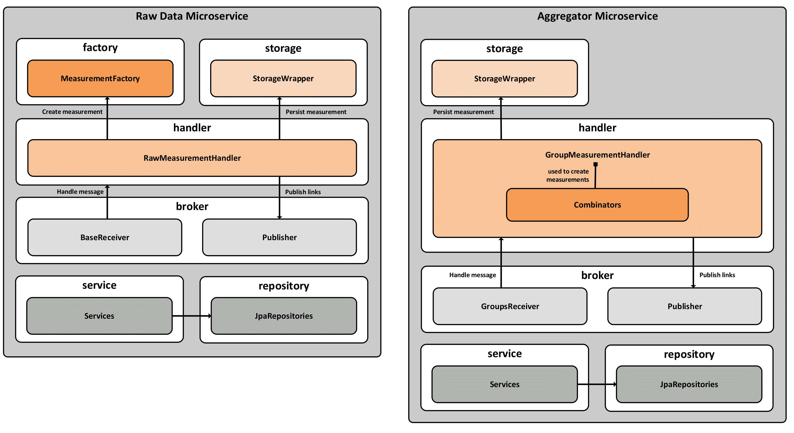
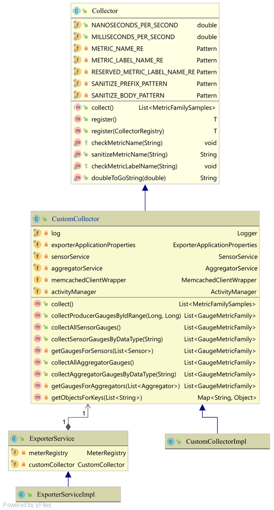

# Lösungsstrategie
Dieses Modul stellt eine erweiterbare Code-Basis dar.
Sie stellt Funktionalität für alle weiteren Microservices bereit.
Zudem bietet sie Möglichkeiten der Erweiterung und Modifikation.
Dadurch wird der Implementierungsaufwand neuer Services minimiert.

# Statisches Modell

## Verteilungssicht
Zuerst wurde die Anbindung der Sensoren, sowie die Verarbeitung der Sensordaten konzipiert.
In diesem Kontext musste der Datenfluss festgelegt werden. Insbesondere wie Daten vom Message Broker konsumiert werden.
Es wurde auch ein Konzept zur Aggregatbildung erstellt. Die folgende Grafik stellt die unterschiedliche Verarbeitung
von Rohdaten sowie von Messwerten zwecks Bildung von Aggregaten dar.
Hier wird abgebildet, wie die Exchanges, Queues und Bindings von RabbitMQ eingesetzt werden.

Die Daten werden dann durch den Prometheus Exporter als Metriken aufbereitet, indem sie aus dem Cache gelesen werden.
Wie diese Logik funktioniert kann in der entsprechenden [README-Datei](../prometheus-exporter-service) nachvollzogen werden.

## Bausteinsicht
Anschließend musste der Aufbau der Microservices festgelegt werden. Dazu wurde auf ein Schichtenmodell zurückgegriffen.
Die verschiedenen Schichten sind in folgender Abbildung dargestellt.

* Die **JPARepositories** stellen Create, read, update and delete (CRUD) Funktionalität im
Hibernate-Kontext bereit.
* Die **Services** beinhalten Geschäftslogik und greifen auf Repositories zur Datenabfrage
zu.
* Der **BaseReceiver** baut eine Verbindung mit dem Message Broker auf und registriert
die nötigen Bindings. Er übergibt ein Callback, also eine Rückruffunktion
zur Verarbeitung der ankommenden Nachrichten an den Message Broker.
* Der **RawMeasurementHandler** wird vom Callback im Falle eines Nachrichteneingangs
aufgerufen. Er realisiert die Verarbeitung der Nachricht beginnend mit
der Erzeugung des Messwerts und anschließendem Speichern. Im letzten Schritt
werden Referenzen auf die Messwerte als Links veröffentlicht.
* Die **MeasurementFactory** verarbeitet den Nachrichteninhalt und erzeugt einen
Messwert des jeweiligen Datentyps.
* Der **StorageWrapper** stellt Funktionalität zum Speichern von Messwerten und zur
Zwischenspeicherung zwecks Aggregatbildung bereit.
* Der **Publisher** baut eine Verbindung zum Message Broker auf, realisiert die Veröffentlichung,
also das Publishing der Daten.
* Der **GroupReceiver** baut gleich dem BaseReceiver eine Verbindung zum Message
Broker auf. Die beiden unterscheiden sich jedoch in ihrer Funktionalität.
Der GroupReceiver verwendet unterschiedliche Exchanges und Bindings sowie
einen anderen Aufbau der RoutingKeys. Die Funktionalität des Callbacks ist
ebenso verschieden.
* Der **GroupMeasurementHandler** wird analog zum RawMeasurementHandler aufgerufen.
Er speichert Messwerte zwischen bis alle Daten zur Aggregatbildung
vorliegen. Dann erzeugt er die verschiedenen Aggregatmesswerte mithilfe der
Combinator. Diese werden dann jeweils persistiert und gegebenenfalls erneut
veröffentlicht.
* Ein **Combinator** stellt eine Funktion dar, die aus einer Menge von Messwerten
einen neuen Messwert generiert.
  
## Paketübersicht
Im Folgenden ist die Übersicht über die Pakete zu sehen.

Die folgenden Pakete werden nicht extra als Klassendiagramme dargestellt und kurz erläutert:
* **Package factory**: Beinhaltet sind Klassen zur Erstellung von Messwerten aus Nachrichten für die Rohdatenverarbeitung.
* **Package controller**: Dieses Paket umfasst Klassen für die REST-APIs, die die Metriken für Prometheus anbieten.
* **Package base**: Hier wird grundlegende Logik abgebildet. Zum Beispiel die SetupDataLoader-Klassen, welche für eine Existenz von Stammdaten beim Programmstart sorgen.
* **Package repository**: Hier sind die JPARepositories implementiert, welche für die Datenbankabfragen genutzt werden.
* **Package service**: Dieses Paket dient der zusätzlichen Abstraktion. Aufbauend auf den Repositories werden die Abfragen mit zusätzlicher Logik versehen, wie beispielsweise Plausibilitätsprüfungen.
* **Package exception**: Beinhaltet sind alle Fehlerklassen für eine eigene Fehlerbehandlung.
* **Package utils**: In diesem Paket sind alle Hilfsklassen und Hilfsfunktionen zu finden.

## Klassendiagramme
Es werden die Klassendiagramme der wichtigsten Pakete abgebildet.
Zu sehen ist der Aufbau der Klassen sowie deren Relationen.

### Paket Properties
Die inbegriffenen Klassen sind zur Abbildung der Konfigurationen der Microservices gedacht.

### Paket Entities
In diesem Paket sind die Entitäten zur Abbildung der Datenbanktabellen vorhanden.

### Paket Broker
Dieses Paket beinhaltet die Klassen zur Abbildung der Kommunikation mit dem Message Broker.

### Paket Handler
Die Handler-Klassen übernehmen die Verarbeitung der Nachrichten.

### Paket Storage
Das Paket Storage umfasst alle Klassen, die eine Datenhaltung realisieren.
Hier wird die Kommunikation mit dem Memcached- und dem Minio-Server über Client-Implementierungen realisiert.

### Paket Model
Dieses Paket kapselt alle Modell-Klassen. Sie dienen beispielsweise der Abbildung von Messwerten oder von Funktionen zur Aggregatbildung.

### Paket Exporter
Das Paket Exporter beinhaltet alle Klassen, welche für die Implementierung eines Microservice zum Datenexport an Prometheus dienen.

# Dynamisches Modell

Das dynamische Modell kann anhand folgender Abbildung nachvollzogen werden.
Die erfolgte Umsetzung weicht geringfügig von der Darstellung ab. Da während der Umsetzung auffiel,
dass die Nutzung des Caches zur Persistenz der temporären Dateien zur Aggregatbildung bevorzugt ist.
Aus diesem Grund wurde die Logik dahingehend geändert, dass temporäre Dateien nicht mehr im Object Storage gespeichert wurden.

