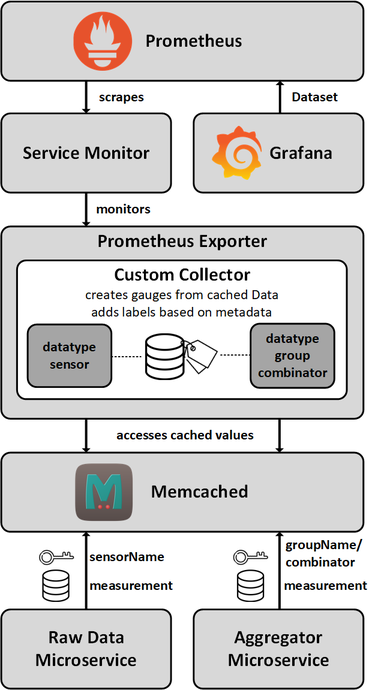

# Lösungsstrategie
Die Lösung stellt ein Proof-Of-Concept dar. Das Modul dient dem Export der Microservice-Daten an Prometheus.
Dazu werden diese als Metriken im Format von Prometheus aufbereitet.
Prometheus fragt in regelmäßigen Zeitabständen, dem sogenannten Scrape-Intervall die REST-Schnittstellen der Microservices ab.
Ein Microservice wird über den ServiceMonitor zum Monitoring markiert. Durch den gemeinsamen Monitor reicht hierbei
das Setzen des Labels *monitoring* auf *true* beim jeweiligen Microservice. Dadurch können die Performance-Metriken eingepflegt werden.
Dieses Modul ermöglicht darüber hinaus die Visualisierung der Sensormesswerte. 
Dazu werden die letzten zum Export markierten Messungen aus dem Cache gelesen.
Anschließend werden diese mit Metadaten angereichert und dann bereitgestellt.
Die folgende Abbildung visualisiert den Ablauf nochmals.



# Getting started
Zuerst ist in das Verzeichnis des Microservices zu navigieren.
Dann muss das Docker Image erstellt und auf Docker Hub publiziert werden.
```
mvn clean install
docker build -t user/prom-exporter-ms .
docker push user/prom-exporter-ms
```
Anschließend müssen die YAML-Datei für den Microservice ausgeführt werden.
Dadurch wird das Deployment erzeugt.
````
kubectl apply -f ./k8s/deployment.yaml
````
Möchte man das Benchmarking des Microservice durchführen, so kann dies durch dies mit den folgenden Befehlen durchgeführt werden.
Hierbei ist zu beachten, dass das Benchmarking im Produktivsystem ausgeführt werden sollte, also im DSL-Cluster.
````
mvn -f benchmarking-pom.xml clean install
docker build -f Dockerfile.benchmarking user/prom-exporter-benchmarking-ms .
docker push user/prom-exporter-benchmarking-ms
kubectl apply -f ./k8s/volumes-DSL.yaml
kubectl apply -f ./k8s/access.yaml
kubectl apply -f ./k8s/pod-DSL.yaml
````
Ist das Benchmarking abgeschlossen und der Pod im Status *Completed*, so kann über folgende Befehle die Ergebnisdatei ins lokale System kopiert werden.
````
kubectl cp default/access-result-storage:out/result.json ./my-result.json
````

## Konfiguration
Die wichtigsten Konfigurationseigenschaften sind:
* `OPEN_WEATHER_API_KEY`: Key der Open Weather API, entnommen von der [Homepage](https://openweathermap.org/appid)
* `OPEN_WEATHER_API_CITIES`: Städteliste
  Hier exemplarisch einige Städte mit zugehöriger ID
    * Saarbruecken - 2842647
    * Moscow - 524901
    * Antarctica - 6255152
    * Rome - 3169070
    * NYC - 5128581
    * Tokyo - 1850147
    * Homburg - 2899449
    * Merzig - 2871675
    * Neunkirchen - 2864435
    * Saarlouis - 2842632
    * St.Wendel - 2841463
    * Stuttgart - 2825297
    * Muenchen - 2867714
    * Berlin - 2950159
    * Potsdam - 2852458
    * Bremen - 2944388
    * Hamburg - 2911298
    * Wiesbaden - 2809346
    * Schwerin - 2834282
    * Hannover - 2910831
    * Duesseldorf - 2934246
    * Mainz - 2874225
    * Dresden - 2935022
    * Magdeburg - 2874545
    * Kiel - 2891122
    * Erfurt - 2929670
* `TEMPERATURE_AGENT_COUNT`: Anzahl an TemperatureAgents, die zufällige Daten generieren und senden
* `HUMIDITY_AGENT_COUNT`: Anzahl an Humidity, die zufällige Daten generieren und senden
* `PICTURE_AGENT_COUNT`: Anzahl an PictureAgents, die ein Bild senden
* `WATER_AGENT_COUNT`: Anzahl an WaterAgents, die zufällige Daten generieren und senden
* `AIRQUALITY_AGENT_COUNT`: Anzahl an AirqualityAgents, die zufällige Daten generieren und senden
